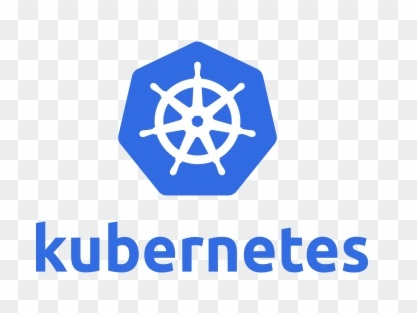

# Kubernetes Ahoy

----

This project is for getting to grips with Kubernetes and containerisation.

----

## What is Kubernetes?  

Is it "an opinionated automation platform"?  

A "suite of things"?

Something else entirely?

## What Does Kubernetes Do?  

AKA "What does Kubernetes do best?"

## How Can I Get to Grips with Kubernetes?  

As a first move, skill up in Linux and container fundamentals.

E.g. what's the use case(s) for containers?

----

## Acknowledgments

Sources of useful information that may not be explicitly credited inline.

### Primary Sources

- [Kubernetes Documentation](https://kubernetes.io/docs/home/)
- [Certified Kubernetes Administrator (CKA) Program](https://www.cncf.io/certification/cka/)

### Secondary Sources

Caveat: many of the links below have been added on the basis of, "hmmm, this could be useful one of these days..."  As I work my way through them, I'll promote any that I find especially useful to "Primary Sources", add a comment to any that I think are (still) valid "Secondary Sources", and get rid of any that don't, as they say, cut the mustard (albeit imho..!)

- [Autoscaling Versus Kubernetes](https://www.reddit.com/r/devops/comments/vlahs6/autoscaling_vs_kubernetes/?sort=new)
- [Awesome-Kubernetes - a curated list for awesome Kubernetes sources](https://github.com/ramitsurana/awesome-kubernetes)
- [CKA Exam Study Guide (Certified Kubernetes Administrator)](https://net-runner.io/cka-exam-study-guide-certified-kubernetes-administrator/)
- [Container Certification Guide - Video](https://www.youtube.com/watch?v=CO0e5lrPuC8)
- [The Docker & Kubernetes Magazine](https://flipboard.com/@dwahlin/the-docker-kubernetes-magazine-vp93fvnrz)
- [Kubernetes at Scale without GitOps Is a Bad Idea](https://thenewstack.io/kubernetes-at-scale-without-gitops-is-a-bad-idea/)
- [Kubernetes The Hard Way - GCP](https://github.com/kelseyhightower/kubernetes-the-hard-way)
- [KubeSkills Community](https://community.kubeskills.com/home)
- [Learning Containers, Kubernetes, and Backend Development with Ivan Velichko](https://iximiuz.com/en/)
- [Resources for Getting Started with Kubernetes](https://vsupalov.com/getting-started-with-kubernetes/)
